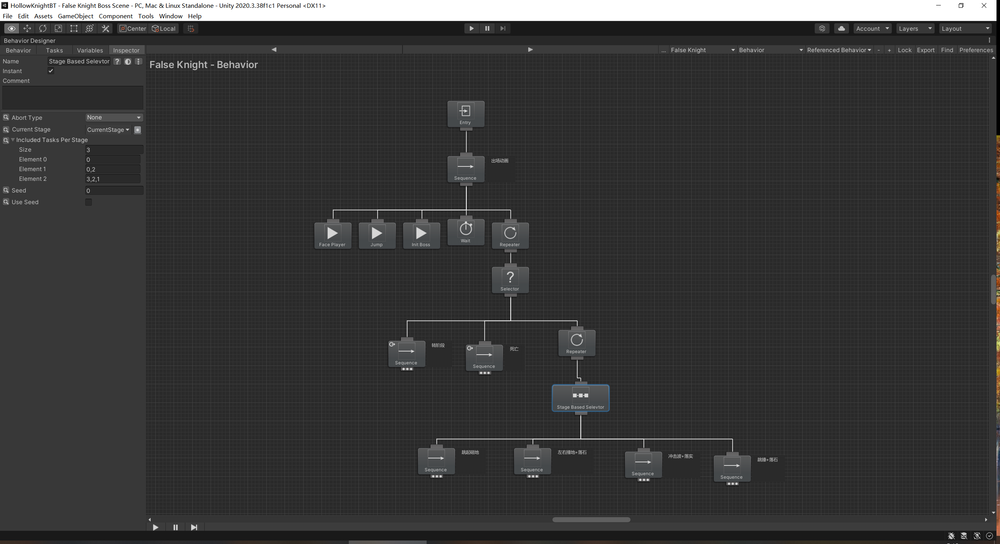

# HollowKnightBT
 使用行为树复刻空洞骑士BOSS的战斗AI

行为树实现
---

BOSS AI
---

流程说明：
1. BOSS进程动画
2. 战斗状态
- 检测BOSS阶段血量是否到达阈值>>暴露本体>>破坏本体，转入下阶段
- 检测本体破坏次数是否达到3次>>BOSS死亡
- 根据BOSS所处阶段在招式池随机选择出招
    - 阶段1：跳起砸地
    - 阶段2：跳起砸地，冲击波+落石
    - 阶段3：跳起捶地+落石，冲击波+落石，左右捶地+落石